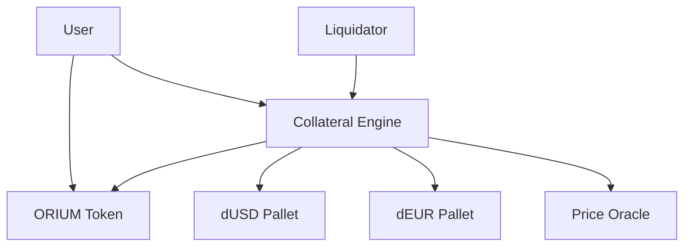

# ORIUM Blockchain Architecture

Comprehensive technical architecture documentation for the ORIUM blockchain, covering consensus, runtime design, pallet architecture, and performance optimizations.

## Table of Contents

- [Overview](#overview)
- [Consensus Architecture](#consensus-architecture)
- [Runtime Architecture](#runtime-architecture)
- [Pallet Architecture](#pallet-architecture)
- [Storage Design](#storage-design)
- [Performance Optimizations](#performance-optimizations)
- [Security Model](#security-model)
- [Network Architecture](#network-architecture)
- [Economic Model](#economic-model)

## Overview

ORIUM is a high-performance Substrate-based Layer 1 blockchain designed for:

- **Native Token**: ORIUM (ORM) with "or" address prefix
- **Stablecoins**: dUSD and dEUR with MakerDAO-style collateralization
- **Consensus**: BABE + GRANDPA for fast finality
- **Performance**: Optimized for ≥50,000 TPS throughput
- **Block Time**: 2 seconds for rapid transaction processing

### Key Design Principles

1. **Performance First**: Runtime optimized for maximum throughput
2. **Financial Stability**: Robust collateralization mechanisms
3. **Decentralization**: BABE + GRANDPA consensus for security
4. **Modularity**: Clean pallet architecture for extensibility
5. **Security**: Comprehensive testing and audit pipeline

## Consensus Architecture

### BABE (Blind Assignment for Blockchain Extension)

ORIUM uses BABE for block production with the following configuration:

```rust
// Epoch configuration
pub const EPOCH_DURATION_IN_BLOCKS: BlockNumber = 10;
pub const EPOCH_DURATION_IN_SLOTS: u64 = EPOCH_DURATION_IN_BLOCKS as u64 * SLOT_DURATION;

// Slot duration: 2 seconds
pub const SLOT_DURATION: u64 = 2000;

// Maximum authorities
pub const MAX_AUTHORITIES: u32 = 100;
```

#### BABE Features
- **VRF-based Selection**: Validators selected using Verifiable Random Functions
- **Slot-based Production**: 2-second slots for consistent block times
- **Equivocation Protection**: Built-in protection against double-signing
- **Fallback Mechanism**: Secondary slots ensure liveness

### GRANDPA (GHOST-based Recursive ANcestor Deriving Prefix Agreement)

GRANDPA provides Byzantine fault-tolerant finality:

```rust
// Finality configuration
pub const GRANDPA_AUTHORITIES_SET_ID: u64 = 0;
pub const GRANDPA_EQUIVOCATION_PROOF_MAX_SIZE: u32 = 1024;
```

#### GRANDPA Features
- **Fast Finality**: ~6 seconds (3 blocks) to finalization
- **Byzantine Fault Tolerance**: Up to 1/3 malicious validators
- **Justification Proofs**: Cryptographic finality proofs
- **Fork Choice**: GHOST rule for optimal chain selection

### Validator Set Management

```rust
// Session configuration
impl pallet_session::Config for Runtime {
    type SessionManager = pallet_session::historical::NoteHistoricalRoot<Self, Staking>;
    type Keys = SessionKeys;
    type NextSessionRotation = pallet_session::PeriodicSessions<Period, Offset>;
}

// Session keys structure
#[derive(Encode, Decode, Clone, PartialEq, Eq, RuntimeDebug)]
pub struct SessionKeys {
    pub babe: BabeId,
    pub grandpa: GrandpaId,
    pub im_online: ImOnlineId,
}
```

## Runtime Architecture

### Runtime Construction

```rust
construct_runtime!(
    pub struct Runtime {
        // System pallets
        System: frame_system,
        Timestamp: pallet_timestamp,
        Balances: pallet_balances,
        TransactionPayment: pallet_transaction_payment,
        
        // Consensus pallets
        Babe: pallet_babe,
        Grandpa: pallet_grandpa,
        Session: pallet_session,
        Historical: pallet_session::historical,
        
        // Custom pallets
        OriumToken: pallet_orium_token,
        CollateralEngine: pallet_collateral_engine,
        Dusd: pallet_dusd,
        Deur: pallet_deur,
        
        // Utility pallets
        Utility: pallet_utility,
        Sudo: pallet_sudo,
    }
);
```

### Runtime Parameters

#### Block Production
```rust
// Optimized for high TPS
pub const MAXIMUM_BLOCK_WEIGHT: Weight = Weight::from_parts(
    4u64 * WEIGHT_REF_TIME_PER_SECOND, // 4 seconds of compute
    u64::MAX,
);

pub const MAXIMUM_BLOCK_LENGTH: u32 = 10 * 1024 * 1024; // 10MB blocks
```

#### Transaction Pool
```rust
// High-throughput transaction pool
pub const TRANSACTION_POOL_SIZE: usize = 8192;
pub const TRANSACTION_POOL_LONGEVITY: u64 = 64;
pub const TRANSACTION_POOL_MAX_PER_SENDER: usize = 256;
```

### Weight System

ORIUM uses Substrate's weight system for resource accounting:

```rust
// Custom weight definitions
pub struct OriumWeights;

impl pallet_orium_token::WeightInfo for OriumWeights {
    fn transfer() -> Weight {
        Weight::from_parts(50_000_000, 0) // 50ms
    }
    
    fn mint() -> Weight {
        Weight::from_parts(75_000_000, 0) // 75ms
    }
    
    fn burn() -> Weight {
        Weight::from_parts(60_000_000, 0) // 60ms
    }
}
```

## Pallet Architecture

### Core Pallets

#### 1. ORIUM Token Pallet (`pallet-orium-token`)

**Purpose**: Native ORM token implementation with ERC-20-like functionality.

```rust
#[pallet::pallet]
pub struct Pallet<T>(_);

#[pallet::storage]
pub type Balances<T: Config> = StorageMap<
    _,
    Blake2_128Concat,
    T::AccountId,
    T::Balance,
    ValueQuery,
>;

#[pallet::storage]
pub type TotalSupply<T: Config> = StorageValue<_, T::Balance, ValueQuery>;

#[pallet::storage]
pub type Allowances<T: Config> = StorageDoubleMap<
    _,
    Blake2_128Concat,
    T::AccountId, // Owner
    Blake2_128Concat,
    T::AccountId, // Spender
    T::Balance,
    ValueQuery,
>;
```

**Key Features**:
- ERC-20 compatible interface
- Mint/burn functionality
- Allowance system for delegated transfers
- Event emission for all operations

#### 2. Collateral Engine Pallet (`pallet-collateral-engine`)

**Purpose**: MakerDAO-style CDP management for stablecoin collateralization.

```rust
#[derive(Encode, Decode, Clone, PartialEq, Eq, RuntimeDebug, TypeInfo)]
pub struct Cdp<Balance> {
    pub collateral: Balance,
    pub dusd_debt: Balance,
    pub deur_debt: Balance,
}

#[pallet::storage]
pub type Cdps<T: Config> = StorageMap<
    _,
    Blake2_128Concat,
    T::AccountId,
    Cdp<T::Balance>,
    OptionQuery,
>;

#[pallet::storage]
pub type OrmUsdPrice<T: Config> = StorageValue<_, T::Balance, ValueQuery>;

#[pallet::storage]
pub type OrmEurPrice<T: Config> = StorageValue<_, T::Balance, ValueQuery>;
```

**Key Features**:
- CDP creation and management
- Collateral ratio enforcement (150% minimum)
- Liquidation mechanism (130% threshold)
- Price oracle integration
- Multi-currency debt support

#### 3. Stablecoin Pallets (`pallet-dusd`, `pallet-deur`)

**Purpose**: USD and EUR-pegged stablecoins with standard token functionality.

```rust
// Similar structure to ORIUM token but with restricted minting
#[pallet::call]
impl<T: Config> Pallet<T> {
    // Only CollateralEngine can mint/burn
    #[pallet::call_index(3)]
    pub fn mint(
        origin: OriginFor<T>,
        dest: T::AccountId,
        amount: T::Balance,
    ) -> DispatchResult {
        T::MintOrigin::ensure_origin(origin)?;
        // Minting logic
    }
}
```

### Pallet Interactions



#### Interaction Flow
1. **Collateral Deposit**: User deposits ORM tokens to CollateralEngine
2. **Stablecoin Minting**: CollateralEngine mints dUSD/dEUR to user
3. **Ratio Monitoring**: System monitors collateral ratios continuously
4. **Liquidation**: Liquidators can liquidate undercollateralized positions

## Storage Design

### Efficient Storage Patterns

#### 1. Single Storage Items
Used for global state that changes infrequently:

```rust
#[pallet::storage]
pub type TotalSupply<T: Config> = StorageValue<_, T::Balance, ValueQuery>;

#[pallet::storage]
pub type OrmUsdPrice<T: Config> = StorageValue<_, T::Balance, ValueQuery>;
```

#### 2. Storage Maps
Used for account-based data:

```rust
#[pallet::storage]
pub type Balances<T: Config> = StorageMap<
    _,
    Blake2_128Concat, // Efficient hasher for AccountId
    T::AccountId,
    T::Balance,
    ValueQuery, // Returns 0 for non-existent entries
>;
```

#### 3. Double Maps
Used for complex relationships:

```rust
#[pallet::storage]
pub type Allowances<T: Config> = StorageDoubleMap<
    _,
    Blake2_128Concat, // Owner hasher
    T::AccountId,
    Blake2_128Concat, // Spender hasher
    T::AccountId,
    T::Balance,
    ValueQuery,
>;
```

### Storage Optimization Techniques

#### 1. Bounded Collections
```rust
use frame_support::BoundedVec;

#[pallet::storage]
pub type LiquidationQueue<T: Config> = StorageValue<
    _,
    BoundedVec<T::AccountId, T::MaxLiquidations>,
    ValueQuery,
>;
```

#### 2. Compact Encoding
```rust
#[derive(Encode, Decode, Clone, PartialEq, Eq, RuntimeDebug, TypeInfo)]
pub struct CompactCdp<Balance> {
    #[codec(compact)]
    pub collateral: Balance,
    #[codec(compact)]
    pub dusd_debt: Balance,
    #[codec(compact)]
    pub deur_debt: Balance,
}
```

#### 3. Storage Migrations
```rust
pub mod v1 {
    use super::*;
    
    pub fn migrate<T: Config>() -> Weight {
        // Migration logic for storage upgrades
        T::DbWeight::get().reads_writes(1000, 1000)
    }
}
```

## Performance Optimizations

### Runtime Optimizations

#### 1. Block Weight Configuration
```rust
// Optimized block weights for high TPS
parameter_types! {
    pub RuntimeBlockWeights: BlockWeights = BlockWeights::with_sensible_defaults(
        Weight::from_parts(4u64 * WEIGHT_REF_TIME_PER_SECOND, u64::MAX),
        NORMAL_DISPATCH_RATIO,
    );
    
    pub RuntimeBlockLength: BlockLength = BlockLength::max_with_normal_ratio(
        10 * 1024 * 1024, // 10MB blocks
        NORMAL_DISPATCH_RATIO,
    );
}
```

#### 2. Transaction Pool Optimization
```rust
// High-throughput transaction pool settings
pub const TRANSACTION_POOL_SIZE: usize = 8192;
pub const TRANSACTION_POOL_LONGEVITY: u64 = 64;
pub const TRANSACTION_POOL_MAX_PER_SENDER: usize = 256;
```

#### 3. Batch Operations
```rust
// Utility pallet for batching transactions
impl pallet_utility::Config for Runtime {
    type RuntimeEvent = RuntimeEvent;
    type RuntimeCall = RuntimeCall;
    type PalletsOrigin = OriginCaller;
    type WeightInfo = pallet_utility::weights::SubstrateWeight<Runtime>;
}
```

### Database Optimizations

#### 1. RocksDB Configuration
```rust
// Optimized database settings
pub fn database_config() -> DatabaseConfig {
    DatabaseConfig {
        max_open_files: Some(10000),
        memory_budget: Some(512 * 1024 * 1024), // 512MB
        path_prefix: PathBuf::from("orium-db"),
    }
}
```

#### 2. State Caching
```rust
// Large state cache for better performance
pub const STATE_CACHE_SIZE: usize = 1024 * 1024 * 1024; // 1GB
```

### Network Optimizations

#### 1. Connection Limits
```rust
// High connection limits for validators
pub const MAX_IN_PEERS: u32 = 50;
pub const MAX_OUT_PEERS: u32 = 50;
pub const MAX_RUNTIME_INSTANCES: u32 = 32;
```

#### 2. Block Announcement
```rust
// Optimized block announcement settings
pub const BLOCK_ANNOUNCE_THRESHOLD: u32 = 10;
pub const MAX_BLOCK_ANNOUNCE_SIZE: u32 = 1024 * 1024; // 1MB
```

## Security Model

### Financial Invariants

#### 1. Collateral Ratio Enforcement
```rust
fn ensure_collateral_ratio(
    collateral: Balance,
    debt_usd: Balance,
    debt_eur: Balance,
    orm_usd_price: Balance,
    orm_eur_price: Balance,
) -> DispatchResult {
    let collateral_value_usd = collateral
        .saturating_mul(orm_usd_price)
        .saturating_div(PRICE_PRECISION);
    
    let total_debt_usd = debt_usd.saturating_add(
        debt_eur.saturating_mul(orm_eur_price).saturating_div(orm_usd_price)
    );
    
    let ratio = collateral_value_usd
        .saturating_mul(10000)
        .saturating_div(total_debt_usd);
    
    ensure!(ratio >= MIN_COLLATERAL_RATIO, Error::<T>::CollateralRatioTooLow);
    Ok(())
}
```

#### 2. Supply Conservation
```rust
// Ensure total supply equals sum of balances
fn verify_supply_invariant<T: Config>() -> bool {
    let total_supply = TotalSupply::<T>::get();
    let sum_of_balances: T::Balance = Balances::<T>::iter()
        .map(|(_, balance)| balance)
        .fold(Zero::zero(), |acc, balance| acc.saturating_add(balance));
    
    total_supply == sum_of_balances
}
```

### Access Control

#### 1. Origin Types
```rust
// Custom origin for restricted operations
#[derive(Clone, PartialEq, Eq, RuntimeDebug)]
pub enum Origin {
    Root,
    Oracle,
    CollateralEngine,
}

// Origin implementation
impl From<Origin> for RuntimeOrigin {
    fn from(origin: Origin) -> Self {
        match origin {
            Origin::Root => RuntimeOrigin::root(),
            Origin::Oracle => RuntimeOrigin::signed(ORACLE_ACCOUNT),
            Origin::CollateralEngine => RuntimeOrigin::signed(COLLATERAL_ENGINE_ACCOUNT),
        }
    }
}
```

#### 2. Permission Checks
```rust
#[pallet::call]
impl<T: Config> Pallet<T> {
    #[pallet::call_index(0)]
    pub fn update_price(
        origin: OriginFor<T>,
        pair: Vec<u8>,
        price: T::Balance,
    ) -> DispatchResult {
        // Only oracle can update prices
        T::OracleOrigin::ensure_origin(origin)?;
        
        // Update price logic
        Ok(())
    }
}
```

### Liquidation Security

#### 1. Liquidation Protection
```rust
fn can_liquidate<T: Config>(
    account: &T::AccountId,
    cdp: &Cdp<T::Balance>,
) -> bool {
    let ratio = calculate_collateral_ratio::<T>(cdp);
    ratio < LIQUIDATION_THRESHOLD
}
```

#### 2. Liquidation Incentives
```rust
// Liquidation bonus for liquidators
pub const LIQUIDATION_PENALTY: Percent = Percent::from_percent(13);
pub const LIQUIDATOR_REWARD: Percent = Percent::from_percent(10);
```

## Network Architecture

### Node Types

#### 1. Validator Nodes
- **Purpose**: Block production and finalization
- **Requirements**: High uptime, staking, session keys
- **Rewards**: Block rewards and transaction fees

#### 2. Full Nodes
- **Purpose**: Network participation without validation
- **Requirements**: Moderate resources
- **Benefits**: RPC access, network decentralization

#### 3. Archive Nodes
- **Purpose**: Complete historical data storage
- **Requirements**: Large storage capacity
- **Use Cases**: Block explorers, analytics

### P2P Network

#### 1. Discovery Mechanism
```rust
// Bootstrap nodes for network discovery
pub const BOOTNODES: &[&str] = &[
    "/dns/bootnode1.orium.network/tcp/30333/p2p/12D3KooW...",
    "/dns/bootnode2.orium.network/tcp/30333/p2p/12D3KooW...",
];
```

#### 2. Protocol Configuration
```rust
// Network protocol settings
pub const PROTOCOL_ID: &str = "/orium/1.0";
pub const MAX_MESSAGE_SIZE: u32 = 16 * 1024 * 1024; // 16MB
```

### Telemetry and Monitoring

#### 1. Prometheus Metrics
```rust
// Custom metrics for ORIUM
pub struct OriumMetrics {
    pub cdp_count: prometheus::Gauge,
    pub total_collateral: prometheus::Gauge,
    pub liquidation_events: prometheus::Counter,
}
```

#### 2. Health Checks
```rust
// Health check endpoints
pub fn health_check() -> HealthStatus {
    HealthStatus {
        is_syncing: is_major_syncing(),
        peers: peer_count(),
        should_have_peers: !is_dev_mode(),
        cdp_system_healthy: check_cdp_invariants(),
    }
}
```

## Economic Model

### Token Economics

#### 1. ORM Token Distribution
- **Validators**: 40% (staking rewards)
- **Treasury**: 30% (development fund)
- **Community**: 20% (airdrops, incentives)
- **Team**: 10% (4-year vesting)

#### 2. Inflation Model
```rust
// Inflation parameters
pub const TARGET_INFLATION: Percent = Percent::from_percent(7);
pub const VALIDATOR_REWARD_RATIO: Percent = Percent::from_percent(80);
pub const TREASURY_RATIO: Percent = Percent::from_percent(20);
```

### Stablecoin Economics

#### 1. Stability Mechanisms
- **Collateral Backing**: 150% minimum ratio
- **Liquidation System**: Automated liquidations at 130%
- **Stability Fees**: 2% annual fee on debt

#### 2. Risk Parameters
```rust
// Risk management parameters
pub const MIN_COLLATERAL_RATIO: u32 = 15000; // 150%
pub const LIQUIDATION_THRESHOLD: u32 = 13000; // 130%
pub const STABILITY_FEE: Percent = Percent::from_percent(2);
```

### Fee Structure

#### 1. Transaction Fees
```rust
// Fee calculation
impl pallet_transaction_payment::Config for Runtime {
    type OnChargeTransaction = CurrencyAdapter<Balances, ()>;
    type OperationalFeeMultiplier = ConstU8<2>; // Reduced for high TPS
    type WeightToFee = IdentityFee<Balance>;
    type LengthToFee = ConstantMultiplier<Balance, TransactionByteFee>;
    type FeeMultiplierUpdate = SlowAdjustingFeeUpdate<Self>;
}
```

#### 2. CDP Fees
- **Stability Fee**: 2% annually on outstanding debt
- **Liquidation Penalty**: 13% of liquidated collateral
- **Oracle Update Fee**: Minimal fee for price updates

This architecture provides a robust foundation for the ORIUM blockchain, balancing performance, security, and economic sustainability while maintaining the flexibility for future upgrades and enhancements.
